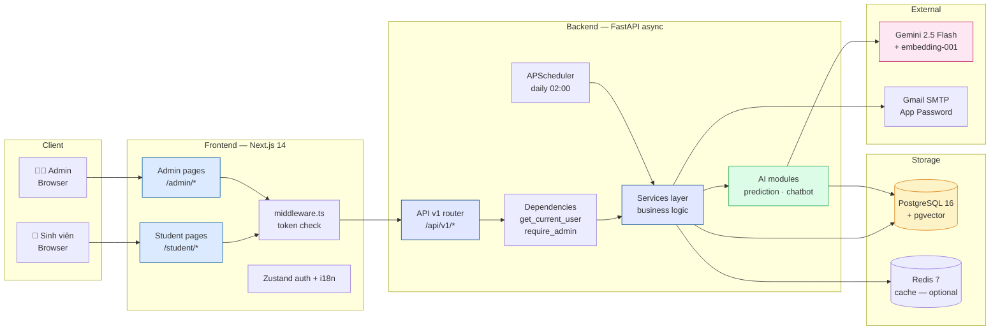
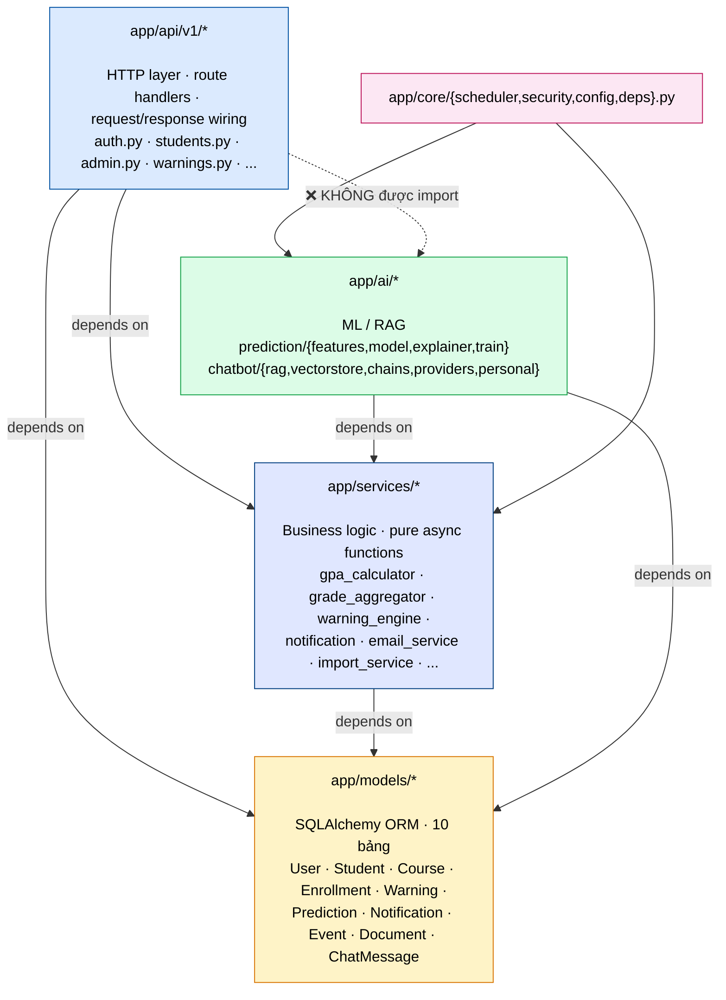
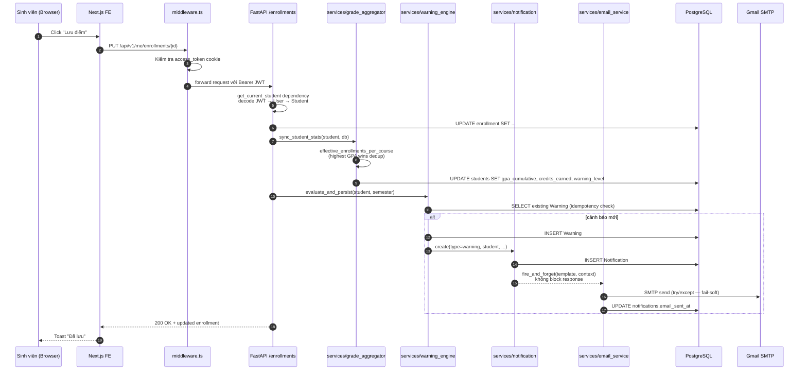
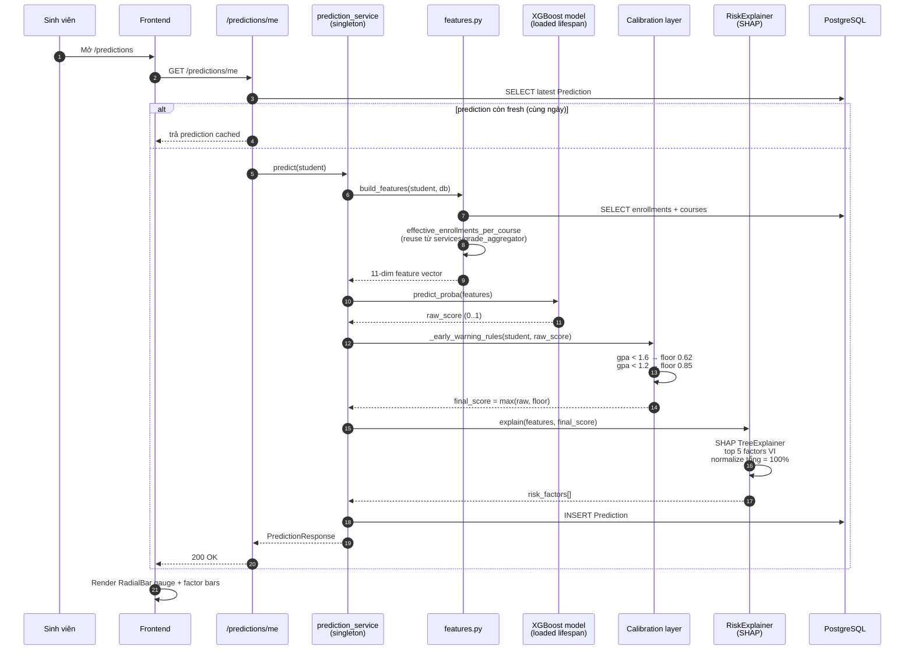
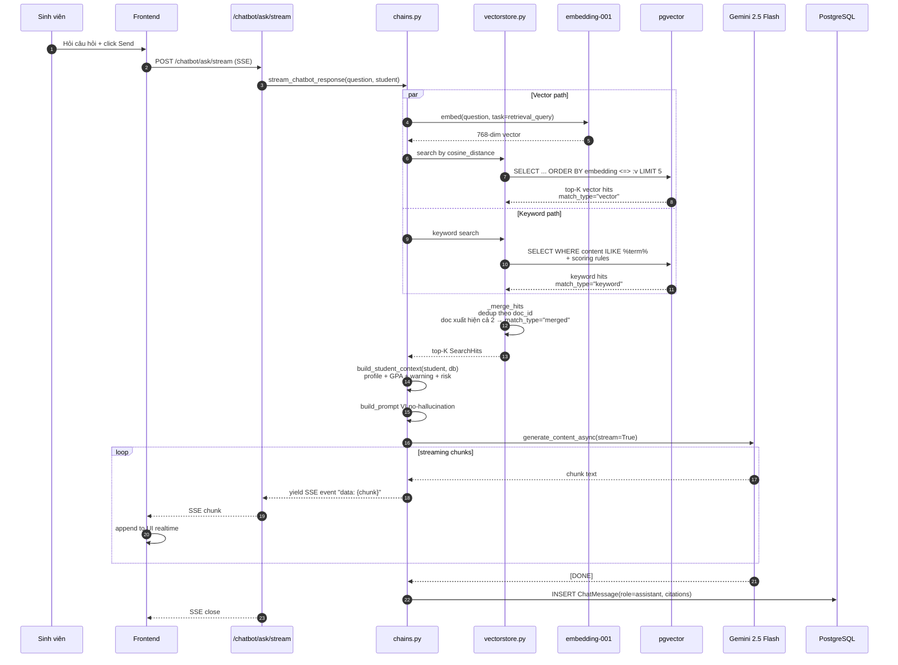
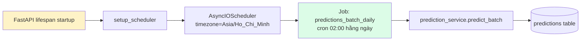
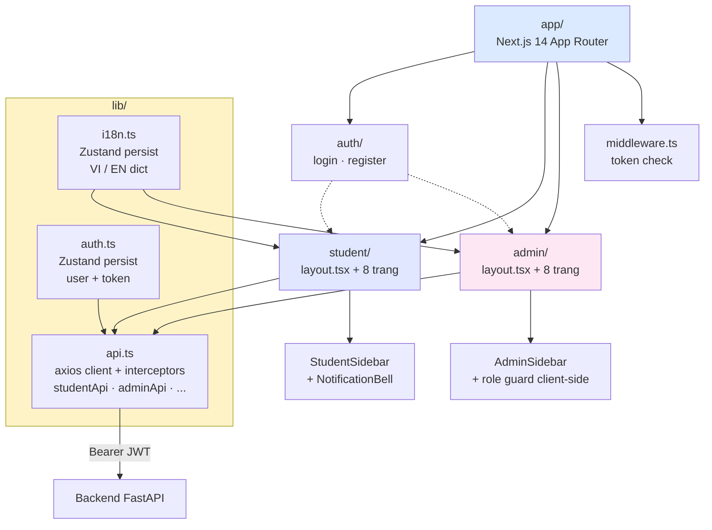
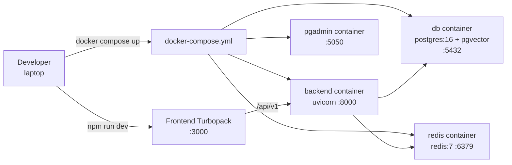

# Kiến trúc hệ thống — AI Warning System (HCMUT)

Tài liệu này mô tả kiến trúc tổng thể, các luồng dữ liệu chính, và rule thiết kế của hệ thống. Tất cả diagram dùng Mermaid — render trực tiếp trên GitHub, VSCode, Marp, hoặc copy vào draw.io.

---

## 1. Kiến trúc tổng quan



**Ghi chú:**
- Frontend Next.js là **client-side rendered** với app router — token JWT lưu trong localStorage + cookie để middleware đọc được.
- Backend FastAPI **async toàn bộ** — SQLAlchemy 2 với asyncpg driver.
- pgvector extension chạy trong cùng PostgreSQL — không cần Pinecone/Weaviate riêng.
- Redis là **optional** — hệ thống chạy được khi không có Redis (config `REDIS_URL` empty).

---

## 2. Layered Architecture (rule cứng)



### Rule cụ thể

> **AI / chatbot KHÔNG được import từ `app.api.v1.*`.** Đây là rule cứng để tránh circular import + giữ AI testable độc lập.

**Cụ thể:**
- ✅ `app/api/v1/predictions.py` import từ `app/ai/prediction/model.py`
- ❌ `app/ai/prediction/features.py` **không** import từ `app/api/v1/students.py`
- ✅ Logic dùng chung (vd "highest GPA wins" theo quy chế HCMUT) PHẢI nằm ở `app/services/grade_aggregator.py` — single source of truth
- ✅ AI/chatbot có thể `from app.services.grade_aggregator import effective_enrollments_per_course` thoải mái

### Hệ quả thiết kế

- Có thể test `app/ai/prediction/*` mà không cần khởi động FastAPI app — chỉ cần một AsyncSession.
- Đổi HTTP layer (vd thêm GraphQL) không phải sửa AI logic.
- Service layer là nơi đặt **invariants** của domain (quy chế HCMUT, validation, idempotency).

---

## 3. Request flow điển hình — SV nhập điểm môn



**Điểm thiết kế quan trọng:**
1. **Bước 8** — `sync_student_stats` áp rule "highest GPA wins" trước khi đánh giá cảnh báo. Nếu không, SV đã học lại đạt môn F vẫn bị cảnh báo nhầm.
2. **Bước 11** — `evaluate_and_persist` **idempotent**: nếu đã có Warning cho cùng `(student, semester, level)` thì skip.
3. **Bước 14-15** — Email **fire-and-forget**: caller không đợi SMTP response. Nếu Gmail timeout, request vẫn trả 200 cho FE.
4. **Demo mode**: khi `SMTP_USER` rỗng, email_service log `[EMAIL DEV MODE]` thay vì gọi SMTP — vẫn lưu `email_sent_at` để hiển thị "đã gửi" trên UI.

---

## 4. Request flow — AI Prediction



**Điểm thiết kế:**
- **Calibration layer** đặt floor lên raw score theo product expectation. Điều này khiến hệ thống KHÔNG phải pure XGBoost — báo cáo cần trình bày: **AI = ML + product calibration**.
- `prediction_service` là **singleton load lúc startup** (`lifespan` event của FastAPI), tránh re-load model 0.14MB cho mỗi request.

---

## 5. Request flow — RAG Chatbot (streaming)



**Điểm thiết kế:**
- **Hybrid retrieval** chứ không pure vector — vì câu hỏi quy chế thường có số liệu cụ thể ("GPA 3.2 xếp loại gì") mà vector embed dễ bỏ sót.
- **Fallback nhiều tầng** ở `providers.py`: Gemini → Hugging Face → local LLM → extractive (no API key vẫn chạy).
- **Streaming thật** với Gemini `stream=True`, không phải fake chunking.
- **Student context inject** vào prompt — chatbot biết được SV này GPA bao nhiêu, đang ở mức cảnh báo nào → trả lời cá nhân hóa.

---

## 6. Background jobs — APScheduler



**Tại sao APScheduler thay Celery?**

| Aspect | Celery | APScheduler |
|---|---|---|
| Process mới | worker + beat + broker (3) | in-process |
| Broker | Redis/RabbitMQ bắt buộc | không cần |
| Setup | ~50 dòng config | ~15 dòng |
| Debug | log scattered | log inline với app |
| Phù hợp | hệ thống production scale | demo + đồ án solo dev |

**Hạn chế hiện tại:** chỉ có 1 job (`predictions_batch_daily`). Job `warnings_batch_daily` **chưa có** — hiện trigger qua admin endpoint hoặc grade-update hook. Đây là điểm có thể bổ sung trong M8.

---

## 7. Frontend architecture



**Điểm thiết kế:**
- 2 layout độc lập (`student/layout.tsx` + `admin/layout.tsx`) — mỗi layout có sidebar riêng + role guard riêng.
- `middleware.ts` chỉ check token tồn tại, không decode role (Edge runtime hạn chế lib). Role guard nằm ở admin layout client-side với redirect.
- `lib/api.ts` chia thành nhiều `*Api` object: `authApi`, `studentApi`, `predictionsApi`, `chatbotApi`, `documentsApi`, `warningsApi`, `notificationsApi`, `studyPlanApi`, `eventsApi`, `adminApi`, `adminEventsApi`.
- `i18n.ts` dùng Zustand persist localStorage → giữ ngôn ngữ cross-session. Cả VI lẫn EN dict đều có cùng keys (compile-time check qua `keyof typeof dict.vi`).

---

## 8. Deployment topology (development)



**Production (chưa làm)** — gợi ý cho M9 hoặc sau đồ án:
- Backend: AWS ECS Fargate hoặc Railway / Render
- Database: AWS RDS PostgreSQL với pgvector enabled (region ap-southeast-1)
- Frontend: Vercel hoặc Cloudflare Pages
- Email: AWS SES thay Gmail SMTP để gửi volume lớn

---

## 9. AI Pipeline — Training (offline)

```mermaid
flowchart LR
    SD[scripts/seed_synthetic.py] --> S1[1000 SV synthetic<br/>4 GPA tiers + retake_success_rate]
    S1 --> S2[65k enrollments<br/>noisy labels v2<br/>+ admin discretion + risk_boost]
    S2 --> FE_BUILD[features.py<br/>build_dataset]
    FE_BUILD --> X[X: 11 features per row]
    FE_BUILD --> Y[y: warning_level >= 1<br/>(16% positive)]
    X --> SPLIT[train_test_split<br/>stratified]
    Y --> SPLIT
    SPLIT --> TR[Optuna 25 trials<br/>5-fold CV<br/>monotonic constraints]
    TR --> TUNE[Threshold tuning<br/>on val set<br/>F1 maximize]
    TUNE --> SAVE[joblib.dump<br/>data/models/v1.joblib]
    SAVE --> METRICS[metrics_v1.json<br/>F1=0.79, AUC=0.98]

    style SD fill:#fef3c7
    style TR fill:#dcfce7
    style SAVE fill:#dbeafe
```

**Lệnh train:**
```bash
docker compose exec backend python -m app.ai.prediction.train
```

**Output:**
- `backend/data/models/v1.joblib` — XGBoost model + feature encoder + threshold (0.14 MB)
- `backend/data/models/metrics_v1.json` — F1, AUC, recall, precision, confusion matrix, threshold

---

## 10. Tài liệu tham khảo nội bộ

- [`CLAUDE.md`](../CLAUDE.md) — Master spec + milestone tracker (source of truth)
- [`ROADMAP.md`](../ROADMAP.md) — Step-by-step plan từng milestone (M1→M9)
- [`docs/SLIDES.md`](./SLIDES.md) — Marp slide deck cho báo cáo
- [`docs/DATABASE_SCHEMA.md`](./DATABASE_SCHEMA.md) — ER diagram + per-table docs
