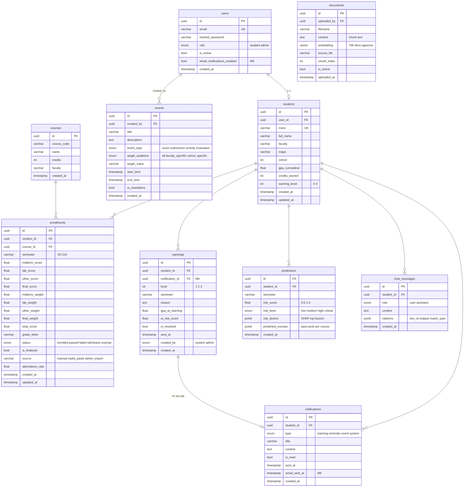

# Database Schema — AI Warning System

**Engine:** PostgreSQL 16 + pgvector extension
**ORM:** SQLAlchemy 2 async + asyncpg
**Migrations:** Alembic (4 revision)

Tổng cộng **10 bảng**. Tất cả PK dùng `UUID` generated Python-side. Tất cả bảng có `created_at`, một số có `updated_at`.

---

## ER Diagram tổng



---

## 1. `users` — Tài khoản

| Column | Type | Notes |
|---|---|---|
| `id` | UUID PK | generated Python-side |
| `email` | VARCHAR UNIQUE | |
| `hashed_password` | VARCHAR | bcrypt 12 rounds |
| `role` | ENUM | `student` \| `admin` |
| `is_active` | BOOLEAN | default `true`. Disable account by setting false |
| `email_notifications_enabled` | BOOLEAN | **M6** — opt-out flag, default `true` |
| `created_at` | TIMESTAMP | server_default now() |

**Relationship:**
- `users.id ← students.user_id` (1-to-1, optional cho admin)
- `users.id ← events.created_by`

**Bootstrap:** mỗi lần FastAPI start, `lifespan` event check tồn tại `admin@hcmut.edu.vn` — nếu chưa có thì tạo với password mặc định `admin123` (xem `app/db/init_db.py`).

---

## 2. `students` — Hồ sơ sinh viên

| Column | Type | Notes |
|---|---|---|
| `id` | UUID PK | |
| `user_id` | UUID FK → users.id | UNIQUE — 1-to-1 |
| `mssv` | VARCHAR(20) UNIQUE | VD: `2211234`, có index |
| `full_name` | VARCHAR(255) | |
| `faculty` | VARCHAR(255) | VD "Khoa học và Kỹ thuật Máy tính" |
| `major` | VARCHAR(255) | VD "Khoa học Máy tính" |
| `cohort` | INTEGER | VD `2022` |
| `gpa_cumulative` | FLOAT | **Tự cập nhật** sau mỗi lần `sync_student_stats`, áp rule highest-wins |
| `credits_earned` | INTEGER | Tổng TC tích lũy (mỗi môn 1 lần) |
| `warning_level` | INTEGER | `0` bình thường, `1`/`2`/`3` cảnh báo |
| `created_at` | TIMESTAMP | |
| `updated_at` | TIMESTAMP | onupdate |

**Quan trọng — quy tắc HCMUT:** `gpa_cumulative` và `credits_earned` được derive từ enrollments theo rule **"highest GPA wins"** (xem [`services/grade_aggregator.py`](../backend/app/services/grade_aggregator.py)). KHÔNG cập nhật trực tiếp.

---

## 3. `courses` — Môn học

| Column | Type | Notes |
|---|---|---|
| `id` | UUID PK | |
| `course_code` | VARCHAR | VD `CO1007`, có index |
| `name` | VARCHAR | |
| `credits` | INTEGER | Số tín chỉ |
| `faculty` | VARCHAR | Khoa phụ trách |
| `created_at` | TIMESTAMP | |

**Auto-create:** khi import grades qua admin (M7), nếu `course_code` chưa tồn tại, hệ thống tự tạo từ Excel row (cần `course_name` + `credits` trong row).

---

## 4. `enrollments` — Đăng ký môn của sinh viên

Bảng quan trọng nhất, lưu kết quả học tập từng học kỳ.

| Column | Type | Notes |
|---|---|---|
| `id` | UUID PK | |
| `student_id` | UUID FK | |
| `course_id` | UUID FK | |
| `semester` | VARCHAR | VD `241` (HK1 2024-2025), `252` (HK2 2025-2026) |
| `midterm_score` | FLOAT NULL | Điểm GK |
| `lab_score` | FLOAT NULL | Điểm thí nghiệm (M3) |
| `other_score` | FLOAT NULL | Điểm BTL/Đồ án/Báo cáo (M3) |
| `final_score` | FLOAT NULL | Điểm CK |
| `midterm_weight` | FLOAT default 0.3 | Trọng số GK |
| `lab_weight` | FLOAT default 0.0 | Trọng số TN |
| `other_weight` | FLOAT default 0.0 | Trọng số BTL |
| `final_weight` | FLOAT default 0.7 | Trọng số CK (sum = 1.0) |
| `total_score` | FLOAT NULL | Tổng kết, auto-compute hoặc lấy từ myBK |
| `grade_letter` | VARCHAR NULL | A+, A, B+, ..., F, RT, MT, DT |
| `status` | ENUM | `enrolled` \| `passed` \| `failed` \| `withdrawn` \| `exempt` |
| `is_finalized` | BOOLEAN default false | `true` = điểm chính thức (từ myBK), không sửa được trên FE |
| `source` | VARCHAR(20) default `manual` | `manual` \| `mybk_paste` \| `admin_import` |
| `attendance_rate` | FLOAT NULL | % điểm danh |
| `created_at`, `updated_at` | TIMESTAMP | |

### Cấu trúc điểm (M3 design)

Trọng số được lưu **per-enrollment** (không phải per-course) → cùng môn học có thể có cấu trúc điểm khác nhau giữa các kỳ.

**12 templates phổ biến HCMUT:**

| Template | GK | TN | BTL | CK | Áp dụng |
|---|---|---|---|---|---|
| Lý thuyết thuần | 30% | 0 | 0 | 70% | Phần lớn môn |
| Lý thuyết + TN | 30% | 20% | 0 | 50% | Vật lý, Mạng MT, OS |
| Lý thuyết + Đồ án | 30% | 0 | 30% | 40% | Lập trình, CSDL |
| Đồ án thuần | 0 | 0 | 100% | 0 | Đồ án CN |
| Báo cáo / Seminar | 0 | 0 | 0 | 100% | Sinh hoạt SV |
| Tùy chỉnh | tùy | tùy | tùy | tùy | Mọi case khác |

### Special grade letters từ myBK

| Letter | Status | Xử lý |
|---|---|---|
| A+ → D | `passed` | Lưu điểm số |
| F | `failed` | Lưu điểm số |
| RT | `withdrawn` | Bỏ điểm số (placeholder) |
| MT | `exempt` | Bỏ điểm, đếm TC, **không tính GPA** |
| DT | `passed` | Bỏ điểm, **không tính GPA** |
| CT, VT, CH, KD, VP, HT | `enrolled` | Skip |

---

## 5. `warnings` — Cảnh báo học vụ

| Column | Type | Notes |
|---|---|---|
| `id` | UUID PK | |
| `student_id` | UUID FK | |
| `notification_id` | UUID FK NULL | **M6** — link cảnh báo ↔ notification gửi đi |
| `level` | INTEGER | `1`, `2`, `3` |
| `semester` | VARCHAR | |
| `reason` | TEXT | Lý do cụ thể, có thể chứa số liệu GPA + risk score |
| `gpa_at_warning` | FLOAT | GPA tại thời điểm cảnh báo (snapshot) |
| `ai_risk_score` | FLOAT NULL | Risk score nếu là AI early warning |
| `is_resolved` | BOOLEAN | SV đã đánh dấu xử lý chưa |
| `sent_at` | TIMESTAMP | thời điểm gửi (set bởi service) |
| `created_by` | ENUM | `system` \| `admin` |
| `created_at` | TIMESTAMP | |

**Idempotency:** `services/warning_engine.py:batch_check_warnings` skip nếu đã có Warning cho cùng `(student_id, semester, level)` để chạy batch nhiều lần không tạo trùng.

---

## 6. `predictions` — AI prediction output

| Column | Type | Notes |
|---|---|---|
| `id` | UUID PK | |
| `student_id` | UUID FK | |
| `semester` | VARCHAR | |
| `risk_score` | FLOAT | `0.0` đến `1.0`, **đã calibrate** (raw XGBoost + product floor) |
| `risk_level` | ENUM | `low` < 0.3, `medium` < 0.6, `high` < 0.8, `critical` >= 0.8 |
| `risk_factors` | JSONB | Top 5 SHAP factors, list of `{label, impact, direction, impact_str}` |
| `predicted_courses` | JSONB | List of `{course_id, course_code, pass_prob}` — **heuristic** dựa trên risk + midterm |
| `created_at` | TIMESTAMP | |

**Lưu ý:** `risk_factors` đã filter các SHAP reason ngược trực giác do baseline comparison; UI chỉ show factors có nghĩa.

---

## 7. `notifications` — Thông báo in-app

| Column | Type | Notes |
|---|---|---|
| `id` | UUID PK | |
| `student_id` | UUID FK | |
| `type` | ENUM | `warning` \| `reminder` \| `event` \| `system` |
| `title` | VARCHAR | |
| `content` | TEXT | |
| `is_read` | BOOLEAN | default false |
| `sent_at` | TIMESTAMP | |
| `email_sent_at` | TIMESTAMP NULL | **M6** — set khi email gửi xong (hoặc demo mode log) |
| `created_at` | TIMESTAMP | |

**Bell badge** ở FE poll `GET /notifications/me/unread-count` mỗi 60 giây.

**Email opt-out flow:**
1. SV toggle ở `/student/notifications` page
2. PUT `/notifications/me/preferences` → update `users.email_notifications_enabled`
3. Lần sau khi `notification_service.create()` chạy, check flag này → skip email nhưng vẫn lưu in-app notification

---

## 8. `events` — Sự kiện học vụ

| Column | Type | Notes |
|---|---|---|
| `id` | UUID PK | |
| `created_by` | UUID FK → users.id | admin tạo |
| `title` | VARCHAR | |
| `description` | TEXT | |
| `event_type` | ENUM | `exam` \| `submission` \| `activity` \| `evaluation` |
| `target_audience` | ENUM | `all` \| `faculty_specific` \| `cohort_specific` |
| `target_value` | VARCHAR NULL | Tên khoa nếu `faculty_specific`, năm khóa nếu `cohort_specific` |
| `start_time` | TIMESTAMP | |
| `end_time` | TIMESTAMP NULL | |
| `is_mandatory` | BOOLEAN | |
| `created_at` | TIMESTAMP | |

**Targeting logic** (xem `services/event_manager.py`):
- `all` → mọi SV
- `faculty_specific` → chỉ SV có `students.faculty == events.target_value`
- `cohort_specific` → chỉ SV có `students.cohort == int(events.target_value)`

---

## 9. `documents` — RAG document chunks

| Column | Type | Notes |
|---|---|---|
| `id` | UUID PK | |
| `uploaded_by` | UUID FK → users.id | admin |
| `filename` | VARCHAR | tên file gốc |
| `content` | TEXT | nội dung **một chunk** (~800 từ) |
| `embedding` | VECTOR(768) | **pgvector**, Gemini `models/embedding-001` |
| `source_file` | VARCHAR | tên file PDF/DOCX gốc — dùng để group chunks cùng tài liệu |
| `chunk_index` | INTEGER | thứ tự chunk trong file (0, 1, 2, ...) |
| `is_active` | BOOLEAN | toggle on/off cho RAG retrieval |
| `uploaded_at` | TIMESTAMP | |

**Pipeline upload:**
1. Admin upload file qua `POST /documents/upload`
2. `app/ai/chatbot/rag.py:parse_pdf` (PyMuPDF) hoặc `parse_docx` extract text
3. `chunk_pages` chia thành chunks 800 từ + overlap 120
4. Mỗi chunk → `embedding-001` → vector 768-dim
5. INSERT vào `documents` table với `source_file` group key

**Retrieval:** `vectorstore.search_documents` query qua pgvector `<=>` operator (cosine distance) + ILIKE keyword fallback.

**Index:** PostgreSQL `ivfflat` index trên `embedding` column (đặt trong migration M5).

---

## 10. `chat_messages` — Lịch sử chat RAG

| Column | Type | Notes |
|---|---|---|
| `id` | UUID PK | |
| `student_id` | UUID FK | |
| `role` | ENUM | `user` \| `assistant` |
| `content` | TEXT | |
| `citations` | JSONB | List of `{document_id, filename, page_number, snippet, match_type}` |
| `created_at` | TIMESTAMP | |

**Multi-turn:** chains.py gắn các messages gần nhất (5 lượt) vào context khi build prompt → chatbot có thể follow-up "Vậy với GPA tôi vừa nói..."

**Citations** là contract giữa BE và FE: mỗi `[1]`, `[2]` trong response trỏ tới citation tương ứng trong list.

---

## Migration history

| Revision | File | Nội dung |
|---|---|---|
| `e55f5d666040` | `_initial_schema.py` | M1+M2: 9 bảng đầu (chưa có chat_messages) |
| `331730d3032d` | `_add_m3_enrollment_fields.py` | M3: thêm `lab_score`, `other_score`, 4 weights, `is_finalized`, `source`; enum `exempt` |
| `9a5d2e7c4b19` | `_add_m5_rag_chatbot.py` | M5: thêm bảng `chat_messages`; ensure pgvector extension |
| `7f4a8b1c2d3e` | `_add_m6_warnings_email_fields.py` | M6: `notifications.email_sent_at`, `users.email_notifications_enabled`, `warnings.notification_id` FK |

**Lệnh tạo migration mới:**
```bash
docker compose exec backend alembic revision --autogenerate -m "describe change"
docker compose exec backend alembic upgrade head
```

> ⚠️ **Không sửa migration cũ.** Mỗi thay đổi schema phải tạo revision mới — đảm bảo upgrade tuyến tính trên prod.

---

## Indexes & performance notes

- `students.mssv` có UNIQUE INDEX (auto)
- `users.email` có UNIQUE INDEX (auto)
- `enrollments(student_id, course_id, semester)` — composite index cần thiết cho effective_enrollments query (hiện chưa explicit, dựa vào FK index)
- `documents.embedding` — `ivfflat` index cho pgvector
- Predictions query "latest per student" dùng subquery `MAX(created_at) GROUP BY student_id` — với 4820 SV chưa cần optimize, nhưng nếu lên 50k+ thì cần index `(student_id, created_at DESC)`.

---

## Tham khảo

- [`backend/app/models/`](../backend/app/models/) — SQLAlchemy ORM definitions
- [`backend/migrations/versions/`](../backend/migrations/versions/) — Alembic revisions
- [`backend/scripts/init.sql`](../backend/scripts/init.sql) — Bootstrap pgvector extension
- [`docs/ARCHITECTURE.md`](./ARCHITECTURE.md) — Kiến trúc hệ thống tổng thể
